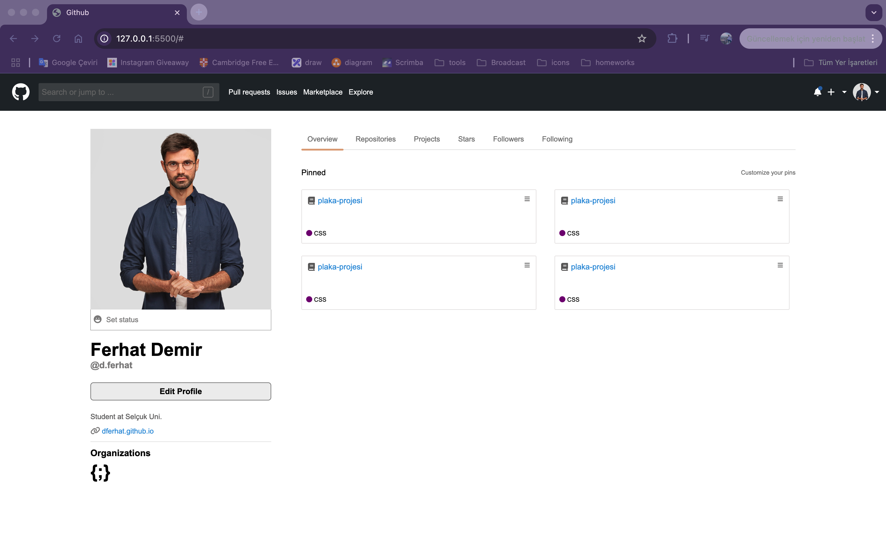

# GitHub Önyüzü

Bu proje, GitHub benzeri bir kullanıcı arayüzü tasarımı sunan **GitHub Clone** isimli web uygulamasıdır. **HTML**, **CSS** ve **SCSS** kullanılarak oluşturulmuş bir projedir.

## ✨ Özellikler
- **Modern Görünüm**: GitHub arayüzüne benzer sade ve profesyonel tasarım.
- **SCSS Desteği**: Daha düzenli ve ölçeklenebilir CSS yapısı.

## 📚 Kullanılan Teknolojiler
- **HTML5**
- **CSS3**
- **SCSS**

## 🚀 Kurulum
Projeyi çalıştırmak için aşağıdaki adımları izleyin:

1. Bu repoyu klonlayın:
   ```bash
   git clone https://github.com/Bahadir34/github-front-end.git
   ```
2. Proje klasörüne gidin:
   ```bash
   cd github-front-end
   ```
3. `index.html` dosyasını tarayıcınızda açın.

## 🖼️ Ekran Görüntüleri


## 👤 Katkıda Bulunma
Projeye katkıda bulunmak isterseniz **pull request** açabilirsiniz.

---
_Bu proje eğitim amaçlı geliştirilmiştir ve herhangi bir ticari amaç taşımamaktadır._

